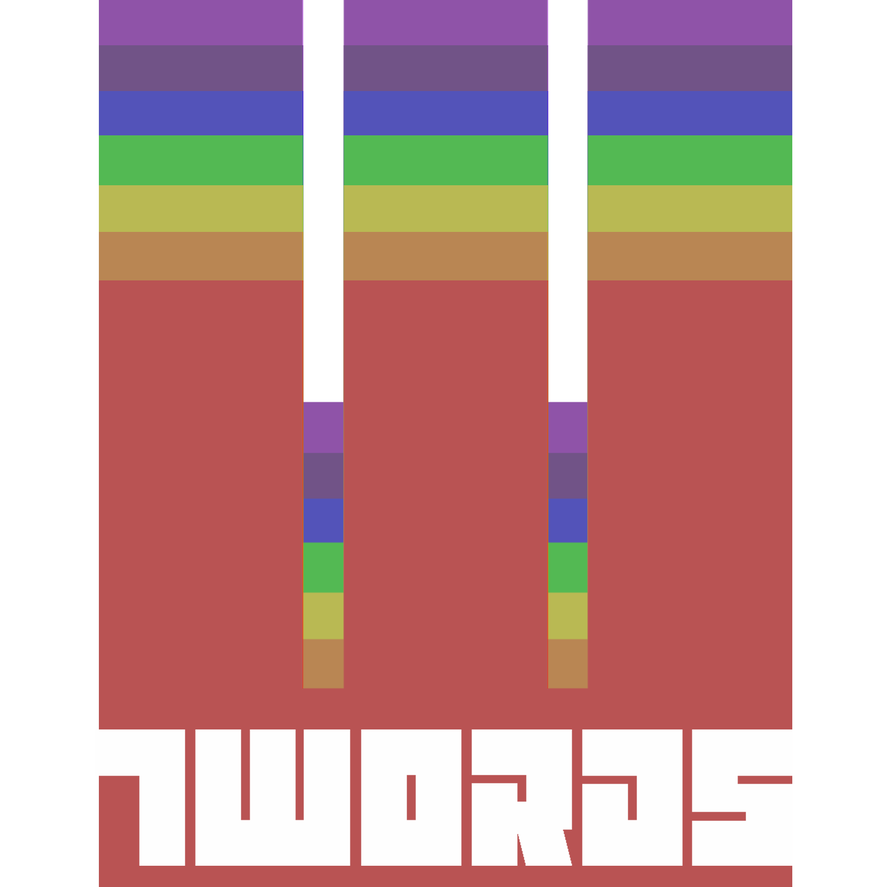

# 7Words

> **7Words is a Python-based tool used to check song lyrics for potentially explicit content.**
>
> Just pass the tool a link to a valid Spotify playlist and 7Words will tell you which songs are clean and which are explicit.

## Who's this project for?
7Words is primarily designed for use by radio stations in the United States. In the US, radio stations are regulated by the Federal Communications Commission (FCC).

In the US, Federal law prohibits obscene, indecent and profane content from being broadcast on the radio or TV.

This project follows the general guidance provided by the FCC in regards to explicit content, [which can be found here](https://www.fcc.gov/consumers/guides/obscene-indecent-and-profane-broadcasts). While the FCC does not clearly state what constitutes explicit content or language, the industry generally adopts a very strict and widely scoped interpretation of what explicit content may be.

## Why was 7Words built?

Complaints filed against broadcasters with the FCC can result in serious fines — they are judged on a per-complaint basis, meaning 10 complaints can result in 10x the normal fine. This cost *The Howard Stern Show*, a nationally syndicated American radio show, **[$2.5 million in fines between 1990 and 2004](https://web.archive.org/web/20111016035918/http://www.washingtonpost.com/wp-srv/business/graphics/web-fcc970.html)**, forcing the show off the air in 2005.

Fines are a constant threat to broadcasters across the world, and 7Words was built to reduce the risk broadcasters take on when airing new music that has not been reviewed for content.

This tool makes it easy for radio DJs to curate songs for their broadcasts without fear of accidentally airing explicit content, reducing time spent manually reviewing each song's lyrics.

## What value does 7Words create?

Typically, **manually reviewing song lyrics can take upwards of 1-2 minutes per song**. The task involves a lot of time on websites like [Genius.com](https://www.genius.com) searching for song titles and reading through lyrics, a manual process prone to error and frustration.

For an hour-long DJ show, it's not uncommon to have 15-20 songs in a playlist, meaning **this task can take upwards of 30 minutes on average**.

> ***In my personal experience as a radio station manager and owner, I've seen many DJs and show hosts frustrated with this process and sometimes even skip it altogether.***

Skipping the content review process can result in *disaster* for a broadcaster, potentially resulting in large fines or even the loss of a broadcasting license — both fatal blows to a radio station of any size.

With 7Words, broadcasters only need to create a Spotify playlist and pass the tool a link. **In less than a minute**, 7Words will determine which songs can be played safely and which require review.

## Okay, how does 7Words work?

Once you pass 7Words a link to your Spotify playlist, it will first contact the Spotify API, a service software developers can use to get information from [Spotify](https://www.spotify.com). 7Words will ask the Spotify API for a list of the songs in your playlist, including the song title and artist name.

Next, 7Words will pass that list of song titles and artist names to the Genius API, a service provided by [Genius.com](https://www.genius.com) to enable software developers to get song lyrics. Once 7Words has received lyrics for each song in your playlist, it will then screen the lyrics for potentially explicit content using a wordlist.

The list 7Words uses is a collection of words that are typically considered explicit, or sometimes used in explicit content. [The wordlist used can be found here.](/badwords.txt)

7Words will split songs into three categories depending on its findings, `Ready to Air`, `Needs Review`, and `Explicit`.

- `Ready to Air` indicates that the song is clean and has no potentially explicit content.
- `Needs Review` indicates that the song need human review, as 7Words has found potentially explicit content.
- `Explicit` indicates that the song contains an egregious amount of potentially explicit content and cannot be safely aired.

At this point, it is expected that the user will review the findings manually and make their own judgements of what is `Ready to Air` and what is `Explicit`.

## Great! So how can 7Words grow as a solution?

>*So glad you asked! There's a lot of work to be done to make 7Words easier to use. I listed some of the most important findings below.*

- The tool needs to have a user friendly front-end.
  - 7Words cannot be easily used at the moment, and requires knowledge of bash commands to use.
  - This effectively restricts its use to technical folk — many of the intended users are not expressly technical.
  - This can be solved by creating a version of 7Words that is hosted online as a web app.
- The tool will generate false negatives and positives. This is caused by the following:
  - Since 7Words uses a wordlist, it is limited in its ability to find explicit language by its own knowledge of explicit language. New slang will have to be added in.
  - The lyrics provided by the Genius API are not always correct.
    - The Genius API will occasionally return lyrics to the incorrect song entirely.
    - Songs that are lower in popularity typically do not have lyrics that are correct or even listed.
    - Songs may have explicit content entered with typos.
  - The tool only works with songs with lyrics entirely in English.
    - Many songs aren't written in English, and 7Words needs to be able to understand what explicit content is across languages and dialects.
  - Problems with typos could potentially be solved by introducing a machine learning component, or a [fuzzy find](https://www.dcc.uchile.cl/TR/1999/TR_DCC-1999-005.pdf) for explicit language.
- The Spotify and Genius APIs are both rate-limited and result-limited.
  - This means that 7Words is limited to reviewing playlists of 99 songs or less.
  - It also means that the speed at which 7Words can generate reports is dependent on how long these API requests take.
    - This can result in the tool taking ~1-2 minutes.

If there are any other issues, please file them on the issues tab or contact @renderos17!

